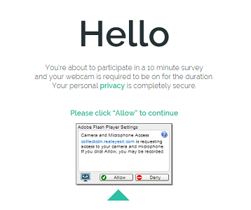
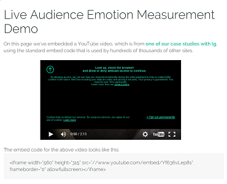
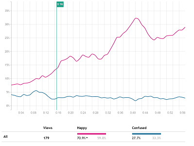

.. Realeyes Developer Portal documentation master file, created by
   sphinx-quickstart on Wed Feb 24 14:42:44 2016.
   You can adapt this file completely to your liking, but it should at least
   contain the root `toctree` directive.

Realeyes Developer portal
=====================================================

Welcome to the Realeyes Developer portal. You'll find comprehensive guides and documentation to help you start integration with our emotion recognition software as quickly as possible, as well as support if you get stuck. Let's jump right in!
    

    

    
.. |desc1| replace:: Integration of Realeyes Collection Platform with various survey software or any other web environment.
.. |desc2| replace:: Allows you to measure how people react to content on your web page. It uses the latest HTML5 standards and web technologies. 
.. |desc3| replace:: Provides API to manage collected data and allows to include Realeyes reports into your web site.

.. |DC1| replace:: **Collection Platform** 
.. _DC1: dc1/index.html

.. |DC2| replace:: **Live Collection Platform** 
.. _DC2: dc2/index.html

.. |API| replace:: **Reporting and Management API** 
.. _API: rapi/index.html

+---------+---------+---------+
| |logo1| | |logo2| | |logo3| |   
|  |DC1|_ |  |DC2|_ |  |API|_ |
| |desc1| | |desc2| | |desc3| |
+---------+---------+---------+
   
.. toctree::
   :maxdepth: 2